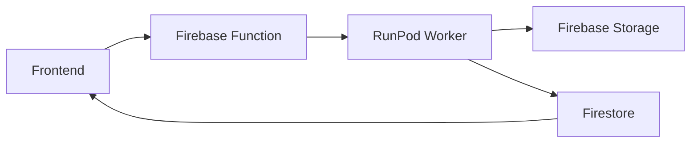

# ✅ FINAL ARCHITECTURE SUMMARY

## 🏗️ **System Architecture**



### **Flow:**
1. **Frontend** → User submits generation request
2. **Firebase Function** → Creates UIDs, initial Firestore doc, calls RunPod
3. **RunPod Worker** → Processes, uploads to Firebase Storage, updates Firestore
4. **Frontend** → Gets real-time updates via Firestore listeners

---

## 📋 **Request Parameters**

### **Required Parameters for RunPod:**
```json
{
  "user_id": "firebase-user-uuid",      // ← From Firebase Auth
  "file_uid": "generated-file-uuid",    // ← Generated by Firebase Function  
  "use_cloud_storage": true,            // ← Enable cloud storage
  "prompt": "your generation prompt",
  // ... other generation parameters
}
```

### **Key Points:**
- ✅ `user_id` and `file_uid` are **request parameters**
- ✅ Firebase Function generates these and passes to RunPod
- ✅ RunPod Worker uses them to update existing Firestore documents

---

## 🗄️ **Firestore Structure**

### **Path:**
```
generations/{user_id}/{media_type}/{file_uid}
```

### **Media Types:**
- `videos` - for video generations
- `images` - for image generations

### **Document Lifecycle:**

#### **1. Initial (Firebase Function):**
```json
{
  "status": "queued",
  "created_at": "<timestamp>",
  "request_data": { /* original request */ },
  "file_uid": "uuid-here",
  "user_id": "user-uuid-here"
}
```

#### **2. Processing (RunPod Worker):**
```json
{
  "status": "processing",
  // ... existing fields remain
}
```

#### **3. Completed (RunPod Worker):**
```json
{
  "status": "completed",
  "completed_at": "<timestamp>",
  "generated": true,
  "modified": "<timestamp>",
  "generation_data": {
    "video_url": "https://storage.googleapis.com/...",
    // or "image_urls": ["url1", "url2"],
    "fps": 15
  },
  // ... existing fields remain
}
```

---

## 📁 **Firebase Storage Structure**

### **Path:**
```
generating/{user_id}/{file_type}/{file_uid}.{extension}
```

### **Examples:**
- Videos: `generating/user123/video/file456.mp4`
- Images: `generating/user123/image/file789.png`
- Multiple Images: `generating/user123/image/file789_0.png`, `file789_1.png`, etc.

---

## ⚙️ **RunPod Environment Variables**

```bash
FIREBASE_SERVICE_ACCOUNT_KEY={"type":"service_account","project_id":"bc-image-gen",...}
FIREBASE_STORAGE_BUCKET=bc-image-gen.firebasestorage.app
```

---

## 🎯 **Frontend Benefits**

### **Easy Querying:**
```javascript
// Get all videos for user
const videosRef = collection(db, 'generations', userId, 'videos');

// Get all images for user  
const imagesRef = collection(db, 'generations', userId, 'images');
```

### **Real-time Updates:**
```javascript
onSnapshot(videosRef, (snapshot) => {
  snapshot.docChanges().forEach((change) => {
    if (change.type === 'modified') {
      const data = change.doc.data();
      if (data.generated && data.status === 'completed') {
        // New video ready!
        showVideo(data.generation_data.video_url);
      }
    }
  });
});
```

### **Type Safety:**
- Clear separation between videos and images
- No need to filter by media type in queries
- Easy to implement different UI for different media types

---

## 🚀 **Deployment Ready**

### **RunPod Integration:**
- ✅ Cloud storage functions ready
- ✅ Firestore update functions ready  
- ✅ Error handling implemented
- ✅ Fallback to base64 if Firebase fails
- ✅ Automatic status tracking

### **Firebase Function Integration:**
- ✅ Clear API contract defined
- ✅ Required parameters documented
- ✅ Firestore structure specified
- ✅ Real-time update patterns provided

### **Frontend Integration:**
- ✅ Real-time listening patterns documented
- ✅ Query examples provided
- ✅ Easy media type separation
- ✅ Status tracking for all states

---

## 📝 **Next Steps**

1. **Firebase Function Developer:**
   - Implement initial document creation
   - Generate UIDs and call RunPod
   - Handle authentication and validation

2. **RunPod Deployment:**
   - Set environment variables
   - Deploy with cloud_storage.py integration
   - Test with Firebase Function calls

3. **Frontend Developer:**
   - Implement Firestore listeners
   - Create UI for real-time updates
   - Handle different media types

---

**🎉 The system is architecturally complete and ready for implementation!**
